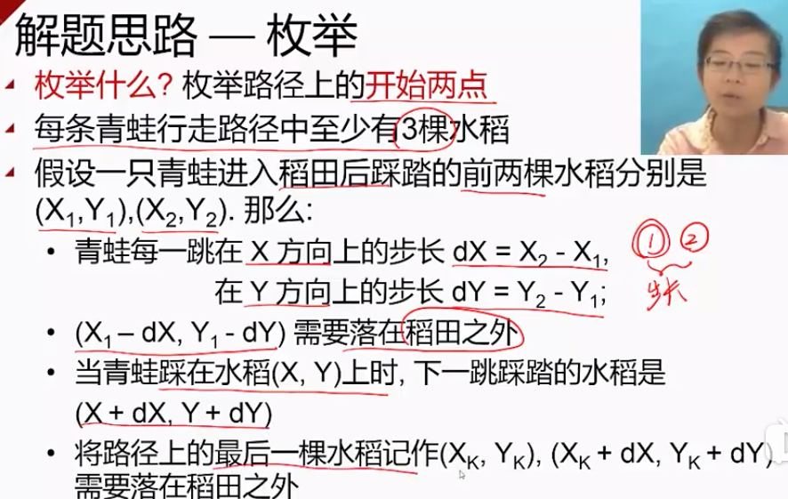
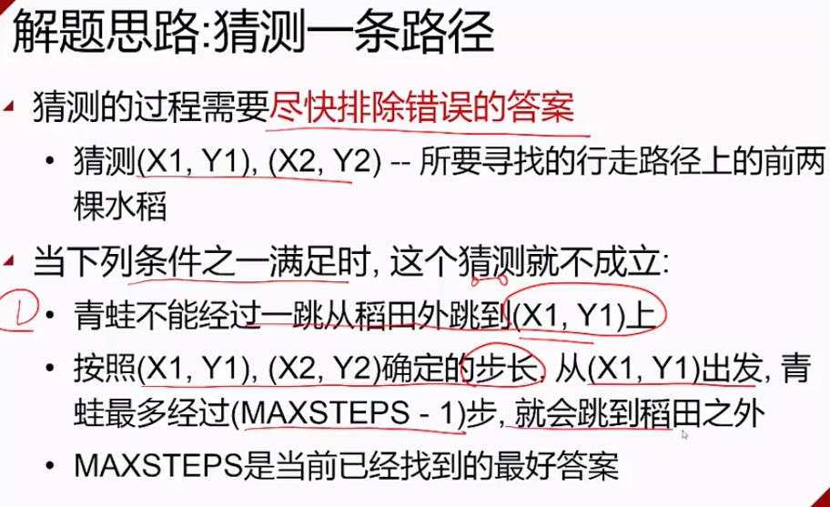

###枚举的基本思想
##### 枚举的基本思想：猜测
##### 枚举中三个关键问题
 * 问题1:给出解空间，建立简洁的数学模型 		
 * 问题2:减少搜索的空间
 * 问题3:采用合适的搜索顺序
 

#####枚举的具体案例1：熄灯问题
* 问题描述
	* 有一个由按钮组成的矩阵，其中每行6个按钮，共5行
	* 每一个按钮的位置上有一盏灯
	* 当按下一个按钮后,该按钮以及周围位置的灯都会改变一次
	* 如果灯原来是点亮的，就会被熄灭，如果灯原来是熄灭的，则会被点亮
		* 在矩阵角上的按钮会改变3盏灯的状态
		* 在矩阵边上的按钮会改变4盏灯的状态
		* 其他按钮会改变5盏灯的状态
	* 对矩阵中的每盏灯设置一个初始的状态
	* 写一个程序，确定需要按下哪些按钮，恰好使得所有的灯都熄灭

* 输入
 * 第一行是一个正整数N，表示需要解决的案列数
 * 每个按钮由5行组成，每一行包括6个数字
 * 这些数字以空格隔开，可以是0或者1
 * 0 表示灯的初始状态是熄灭的
 * 1表示灯的初始状态是点亮的
* 输出
 * 对每个案例，首先输出一行：输出字符串"PUZZLE #M"，其中m是该案例的序号
 * 接着按照该案列的输入格式输出5行
 		* 1表示需要把对应的按钮按下
 		* 0表示不需要按对应的按钮
 		* 每个数字以一个空格隔开
 
 
* 解题分析
 * 第2次按下同一个按钮时，将抵消第一个按下时所产生的结果
 * 每个按钮最多只需要按下一次
 * 各个按钮被按下的顺序对最终结果没有影响
 * 对第一行中每盏点亮的灯，按下第二行对应的按钮，就可以熄灭第一行全部的灯
 * 如此重复下去，可以熄灭第1，2，3，4行的全部灯
 * 如果最后一行的灯全部熄灭，则第一行的状态A就是一个有解的状态，如果A不是解的状态，则第一行换一个状态试试
 * 我们只需要枚举出第一行灯的所有状态2^6 = 64
 * 如果按列来枚举则只有2^5=32中状态
 
* 具体实现
 * 用一个puzzle[5][6]的矩阵来表示灯的初始状态
 * 用一个presee[5][6]的矩阵来表示计算的结果
 * 方案1：6层for循环来枚举第一行所有的状态
 * 方案2：将第一行看做是2进制的数，则循环0-64，每次++
* 简化方案
 * 用一个6*8的数组来表示按钮矩阵，简化计算数组下一行的值的计算公式

 
 * 给定press的第一行取值，计算出presee其他行的取值
 * press[r+1][c]=(puzzle[r][c]+presee[r][c-1]+press[r][c]+press[r][c+1]+press[r-1][c])%2
 * 0<r<5  0<c<7
 
 
 [熄灯问题代码](./puzzle.cpp)
 
 
 #####枚举的具体案例2：讨厌的青蛙
* 问题描述
  * 每到晚上，青蛙会跳跃稻田，从而踩踏稻子，农民早上看到被踩踏的稻子，希望找到造成最大损害的那只青蛙经过的路径
  * 每只青蛙总是沿着一条直线跳跃稻田，且每次跳跃的距离都是相同的
 
 
 
 
 
 * 而在一条青蛙行走路径的直线上，也可能会些被踩踏的水稻不属于该行走路径
 
 
 
  
* 解题思路
 
 
 [讨厌的青蛙代码](./frog.cpp)
 