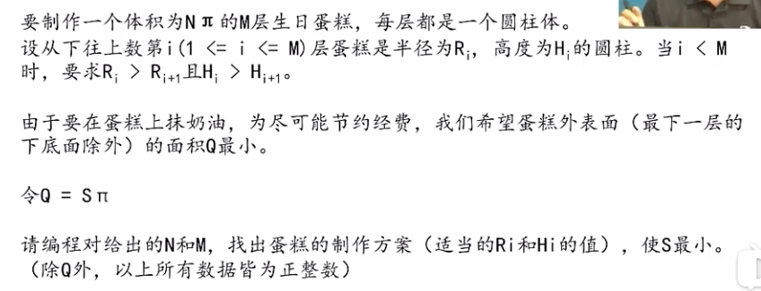

#### 生日蛋糕

* 解题思路
 * 深度优先搜索，枚举每一层可能的高度和半径（最暴力，会超时）
 
 * 搜索范围，底层蛋糕最大可能半径和最大可能高度
 * 搜索顺序，从上往下，或者从下往上  基本原则：先尝试可能性少的步骤
 所以选择从下往上搜索
 * 对同一层蛋糕枚举高度和半径，也是从大到小去试
 
* 剪枝
 * 1.最优化剪枝：程序会记录到目前为止的最优解，如果在枚举的时候当前解已经超过记录的最优解，则停止。 （搭建过程中发现面积超过已经求得的最优表面积）
 * 2.可行性剪枝：搭建过程中预见再往上搭，高度已经无法安排，或者半径已经无法安排，则停止搭建  
 * 3.可行性剪枝：搭建过程中发现，还没搭的那些层的体积，一定会超过还缺的体积，则停止搭建
 * 4.可行性剪枝： 搭建过程中发现，还没搭的那些层的体积，最大也到不了还缺的体积，则停止搭建
 
[生日蛋糕代码](./cake.cpp)
