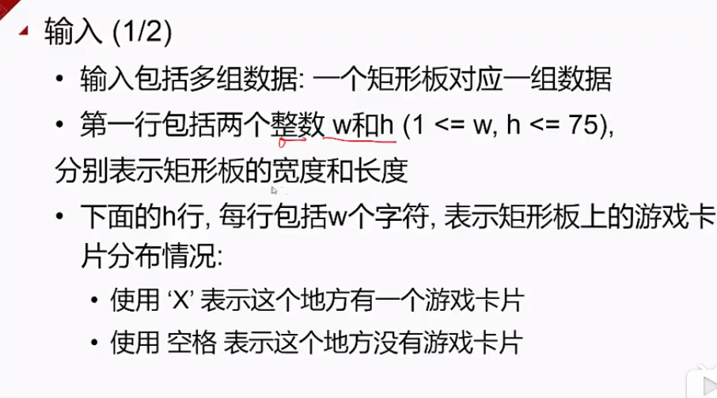

#### 递归的基本思想 #####
##### 总体思想 #####
* 待求解问题的解->输入变量x的函数f(x)
* 通过寻找函数g()，使得f(x)=g(f(x-1))
* 且已知f(0)的值，就可以通过f(0)和g()求出f(x）的值

##### 递归的三个要点 #####
* 递归式
 * 如何将原问题划分成子问题
* 递归出口
 * 递归终止的条件，即最小子问题的求解，可以允许多个出口
* 界函数
 * 问题规模变化的函数，它保证递归的规模向出口条件靠拢

##### 求阶乘的递归程序 #####
* 给定n,求阶乘n!
		
		// for循环实现
		int n,m=1;
		for(int i=2;i<=n;i++)
			m *= i;
		printf("%d的阶乘是%d",n,m);
		
		// 递归实现
		int Factorial(int n){
			if(n == 0)
				return 1;
			else
				return n * Factorial(n-1);
		}
		
##### 递归解决问题的关键 #####
1. 找出递归公式
2. 找到递归终止条件

##### 递归问题：小游戏 #####

[小游戏代码](./game.cpp)

##### 递归问题：棋盘分割 

[棋盘分割代码](./checkerboard.cpp)

